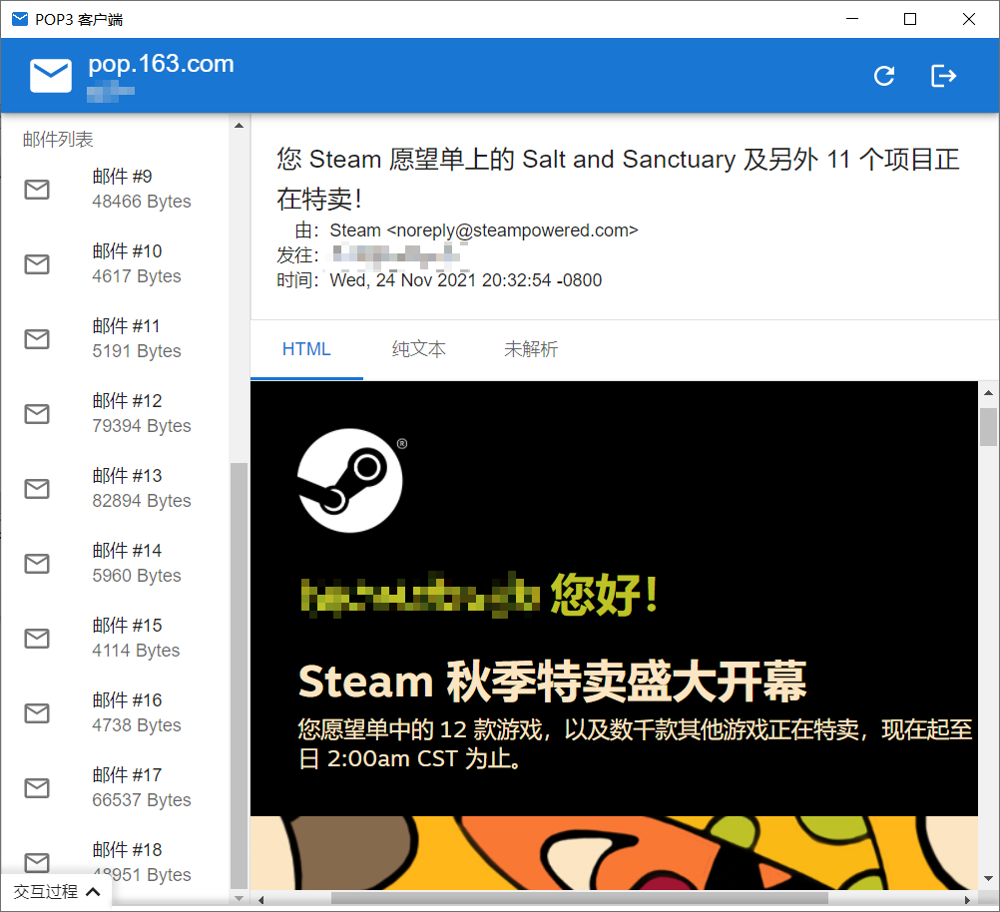

# POP3/POP3S Client

A POP3/POP3S client built with tauri.

**Notice: This is a homework project, use it at your own risk.**

## TODO List

- [x] POP3 implementation
  - [x] `QUIT` Command
  - [x] `STAT` Command
  - [x] `LIST` Command
  - [x] `RETR` Command
  - [ ] `DELE` Command
  - [ ] `NOOP` Command
  - [ ] `RSET` Command
  - [x] `QUIT` Command
  - [ ] `TOP` Command
  - [ ] `UIDL` Command
  - [x] `USER` Command
  - [x] `PASS` Command
  - [ ] `APOP` Command
- [x] POP3S support
- [x] login page
- [x] mail list page
- [x] POP3 interaction panel
- [ ] i18n

## Showcase

## License

MIT